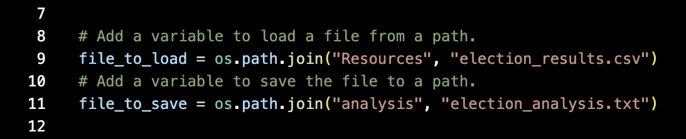
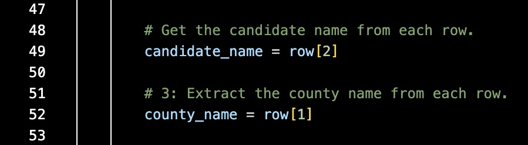
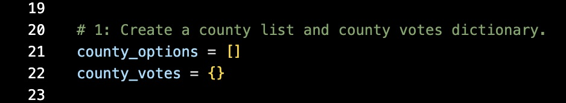

# election-analysis

## Overview of Election Audit

### The purpose of this election analysis audit is to provide the election commission with election results and voter turnout metrics.  

## Election Audit Results

* **Total Votes Cast:** 369,711

* **Votes by County (Highest to Lowest):**
  1. Denver: 82.8% (306,055)
  2. Jefferson: 10.5% (38,855)
  3. Arapahoe: 6.7% (24,801)

* **Largest County Turnout:** Denver

* **Votes by Candidate (Highest to Lowest):** 
  1. Diana DeGette: 73.8% (272,892)
  2. Charles Casper Stockham: 23.0% (85,213)
  3. Raymon Anthony Doane: 3.1% (11,606)

* **Election Winner:** Diana DeGette
  * Winning Vote Count: 272,892
  * Winning Percentage: 73.8%

## Election Audit Summary

### The Python script created for this audit can be used to automate analyses for any election, to include other congressional districts, local elections, and even senatorial districts.  With just a few simple modifications, this script could be used in any election.

1) Modification 1 - File Loaded

#### The script can be modified to load the csv file with another districts' election data.

   
    
2) Modification 2 - Organization of Data (Columns)  

#### If other districts organize their data differently, the script can be modified to pull the candidate and county names from the appropriate columns.

   

3) Modification 3 - Use of "County" in Script

#### References to "County" could be modified in the script to reflect the appropriate jurisdiction, such a "Town" for a local election.

   

Using this script for elections across Colorado would improve both the speed and accuracy of calculating election results.  The current process for calculating election results in Excel is more time consuming and prone to human error than running this Python script.  Through standardizing election analyses processes in Python, the election commission could provide faster and more accurate election results to Colorado voters.
